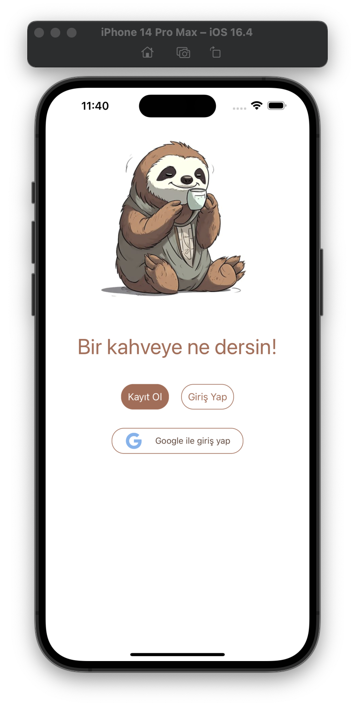
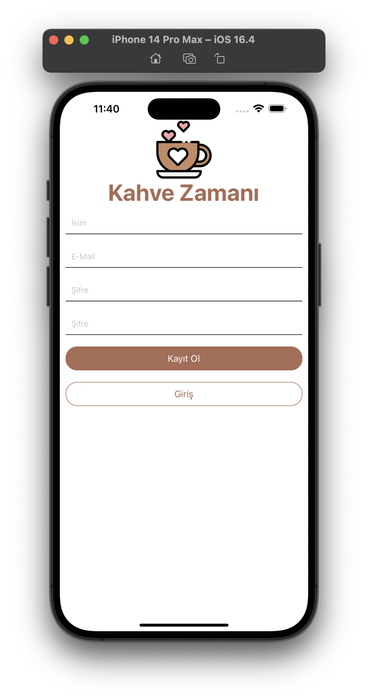
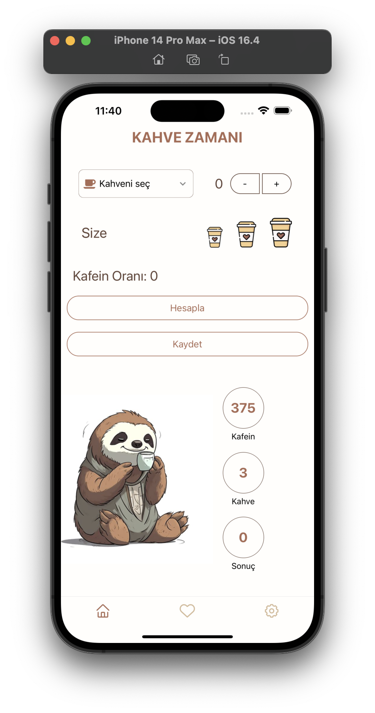
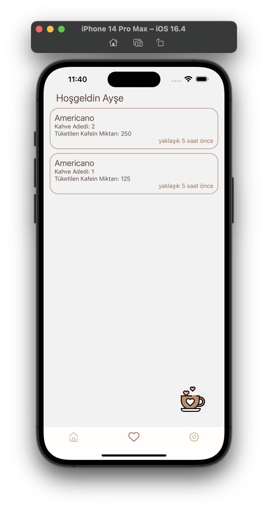
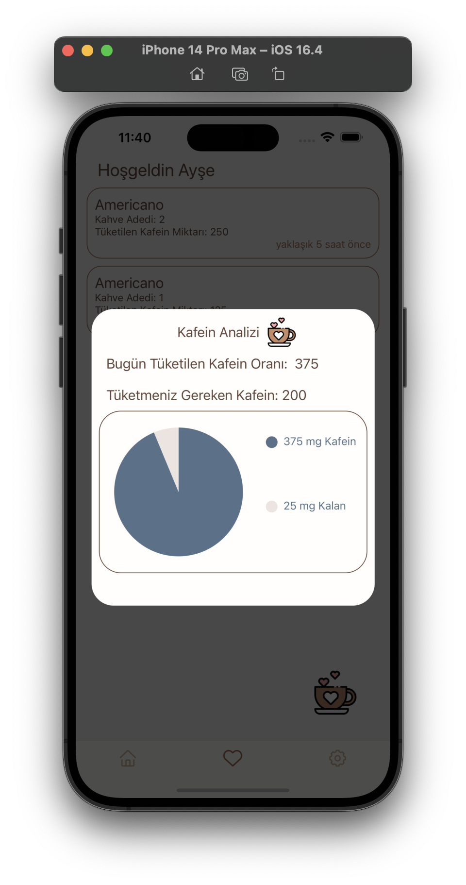
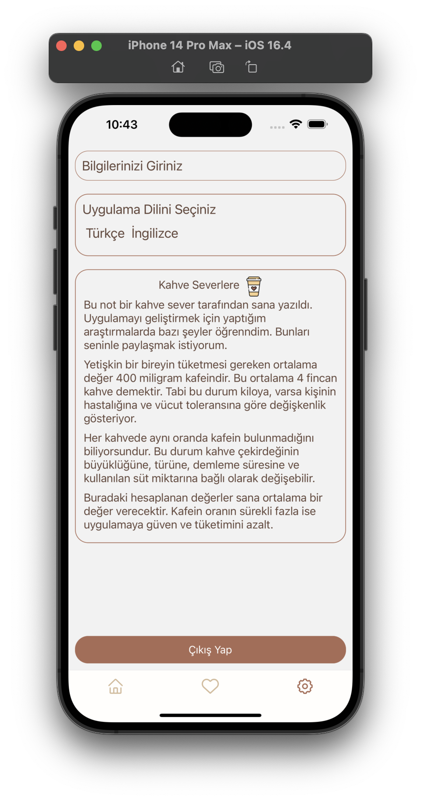
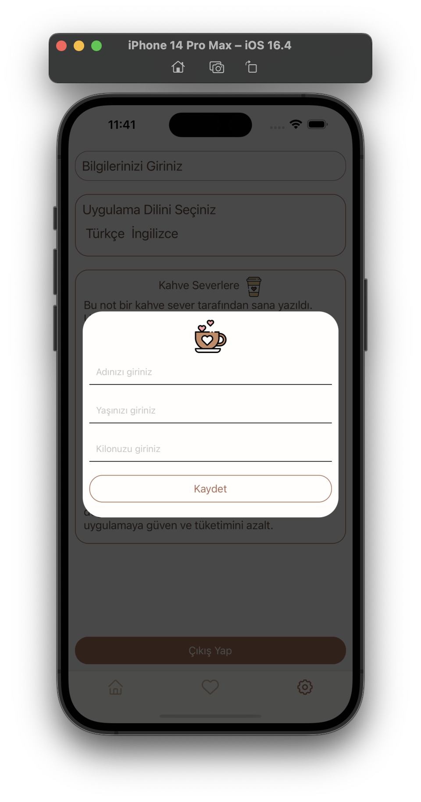
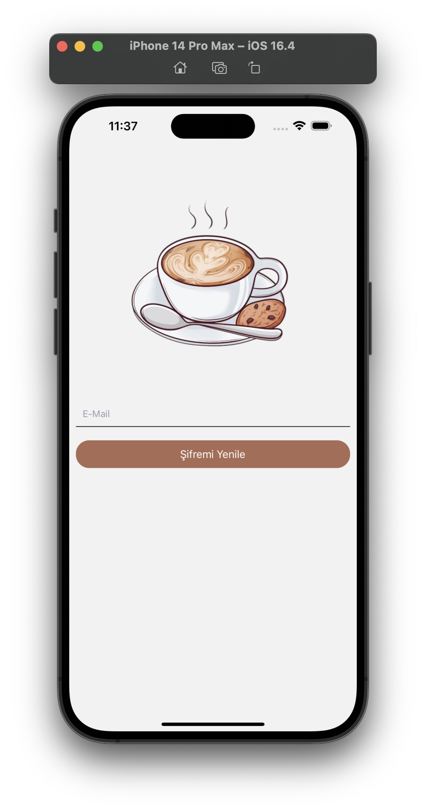

# Welcome to your Coffee Time App ☕️

## Get started

1. Install dependencies

   ```bash
   npm install
   ```

2. Start the app

   ```bash
    npx expo start
   ```

# Auth Page

<div style="display: flex; gap: 5px; align-items: center;">
  
  
  
</div>
<div style="display: flex; gap: 5px; align-items: center;">
  
  
  
</div>
<div style="display: flex; gap: 5px; align-items: center;">
  
  
  
</div>


## Auth Screen Technologies Used

- Yup & Formik
- React Native Navigation (Stack Navigation)
- Google with Sing In 
- Firebase RealTime Database
- Firebase Auth
- Language react-i18next
- Redux (reduxjs/toolkit)
